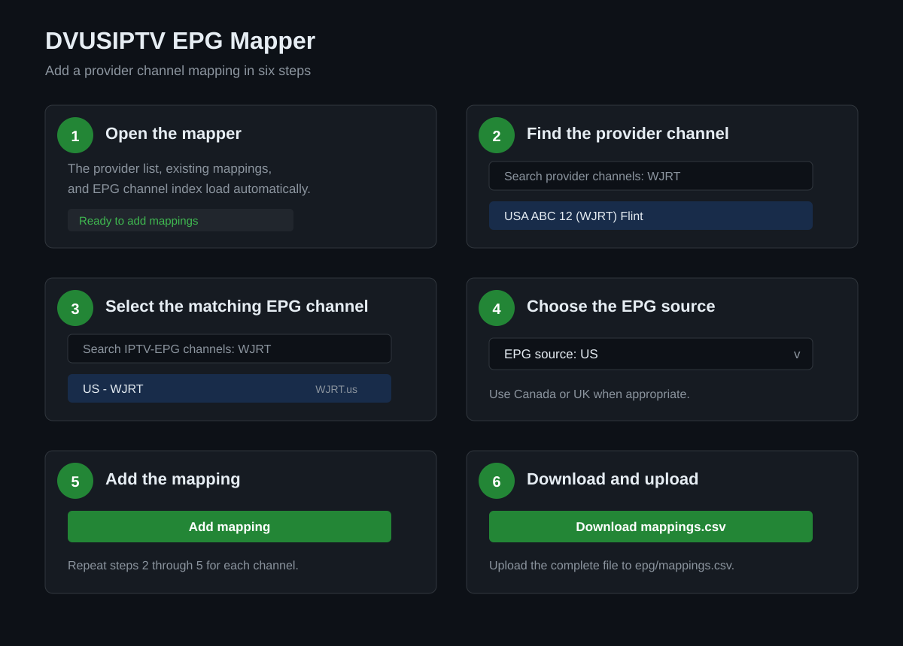
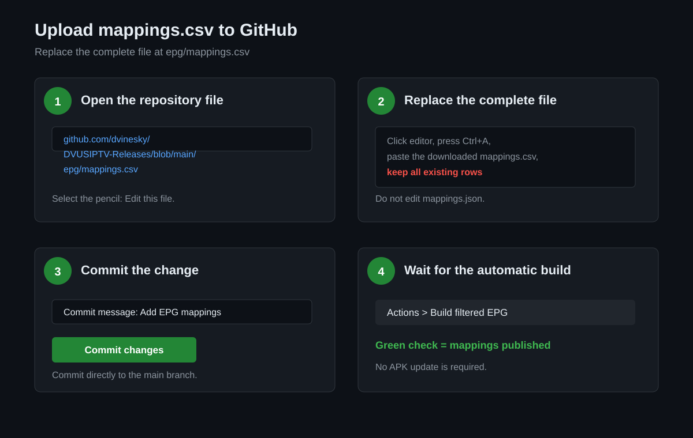

# EPG Mapper Contributor Guide

This guide explains how to add missing EPG listings and publish the result. The mapper does not need the DVUSIPTV Android app installed.

## Before You Start

You must have **Write** access to the `dvinesky/DVUSIPTV-Releases` GitHub repository. You do not need access to the private `DVUSIPTV` repository.

Open the mapper here:

`https://dvinesky.github.io/DVUSIPTV-Releases/epg-mapper/`

The provider channel list, current IPTV-EPG channel index, and existing GitHub mappings load automatically. Allow the page a few seconds to finish loading before making changes.

## Add A Mapping

1. In **Provider channels**, search for the channel by name, number, or local call sign. For example, search `WJRT`.
2. Select the provider channel. The provider stream ID appears in the selected-channel fields and on the right side of the provider row.
3. Select the matching EPG channel from **IPTV-EPG channels**. The mapper filters and ranks likely matches automatically. Verify the EPG ID before adding it.
4. Select the correct **EPG source**: `US`, `Canada`, or `UK`.
5. Select **Add mapping**.
6. Repeat these steps for every missing channel.

The mapping table at the bottom is the export that will be saved. Check that the new row contains the correct provider stream ID, provider name, EPG ID, and source.

## Download The CSV

When all channels are mapped, select **Download mappings.csv**. The browser downloads a file named exactly:

`mappings.csv`

Do not rename it and do not upload only the new rows. The downloaded file must contain the existing mappings plus the new mappings.

## Upload To GitHub

1. Open the repository file directly: [epg/mappings.csv](https://github.com/dvinesky/DVUSIPTV-Releases/blob/main/epg/mappings.csv).
2. Select the **pencil Edit this file** button near the upper-right of the file view.
3. Click inside the file editor and press `Ctrl+A`.
4. Paste the complete contents of the downloaded `mappings.csv` file.
5. Scroll to the **Commit changes** section.
6. Use a message such as `Add EPG mappings`.
7. Select **Commit changes** directly to the `main` branch.

The file must remain at this exact path:

`epg/mappings.csv`

Do not edit `epg/mappings.json` manually. That file is generated automatically.

## Verify The Update

1. Open the repository **Actions** tab.
2. Open the **Build filtered EPG** workflow.
3. Wait for the newest run to show a green check mark.
4. The workflow generates the filtered EPG data and updates `epg/mappings.json` automatically.

The app does not need a new APK for a mapping change. After the workflow finishes, users can refresh the Guide page or restart the app. The app will download the updated mapping data when it next checks GitHub.

## Important Warnings

- Always use the complete CSV downloaded from the mapper.
- Do not begin with a blank mapper export.
- Do not delete existing mapping rows unless you intentionally want to remove those EPG mappings.
- Do not manually edit `mappings.json` or the generated channel files.
- If the GitHub Action fails, do not keep uploading replacement files. Check the workflow error first.

The mapper deliberately does not write to GitHub automatically. A GitHub token must never be placed in a public webpage.
